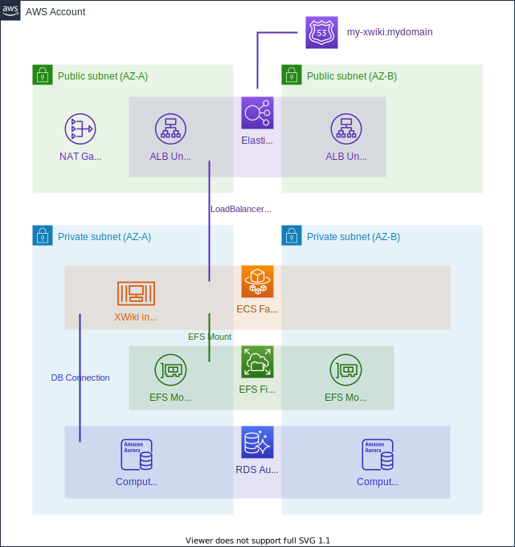

# Welcome to AWS XWiki One-Click Solution

## Architecture and Components



## Documentation and Deployment

For the Documentation of this project please refere to the following Web Source:

- https://aws-blog.de/2020/10/how-to-deploy-xwiki-on-aws-with-one-click.html

or simply follow these deployment steps in order to provision the shown architecture into your AWS Account:

Finally, we are here to deploy the One-Click Solution into your AWS Account into the AWS Frankfurt region just follow these simple steps and you have a running XWiki installation:

1.	Go to Github and Clone or Fork the sources of the solution [here] (https://github.com/marcotesch/xwiki-oneclick-deployment) e.g.:

```sh
git clone https://github.com/marcotesch/xwiki-oneclick-deployment
```
2.	Navigate into the cloned repository:
```sh
cd xwiki-oneclick-deployment
```

3.	Install all needed node packages into the solution locally:
```sh
npm install
```

4.	Execute the actual One Click deployment using either environment variables
```sh
npx cdk deploy "*"
```

or specifying a configured AWS Profile (e.g.: `my-profile`)

```sh
npx cdk deploy "*" –profile my-profile
```

5.	Connect to the LoadBalancer DNS shown in the output of the previous command to configure your newly hosted XWiki installation

## Useful commands

 * `npm run build`   compile typescript to js
 * `npm run watch`   watch for changes and compile
 * `npm run test`    perform the jest unit tests
 * `cdk deploy`      deploy this stack to your default AWS account/region
 * `cdk diff`        compare deployed stack with current state
 * `cdk synth`       emits the synthesized CloudFormation template
